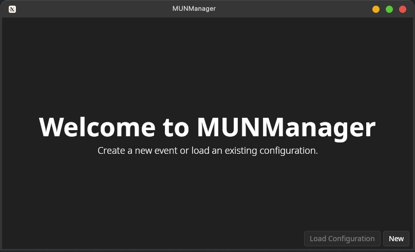
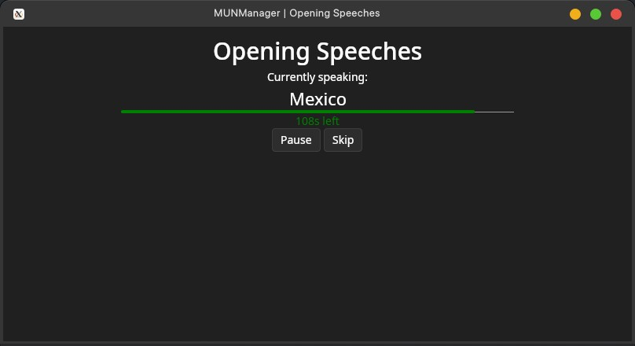
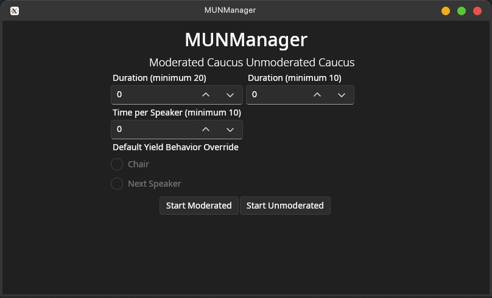
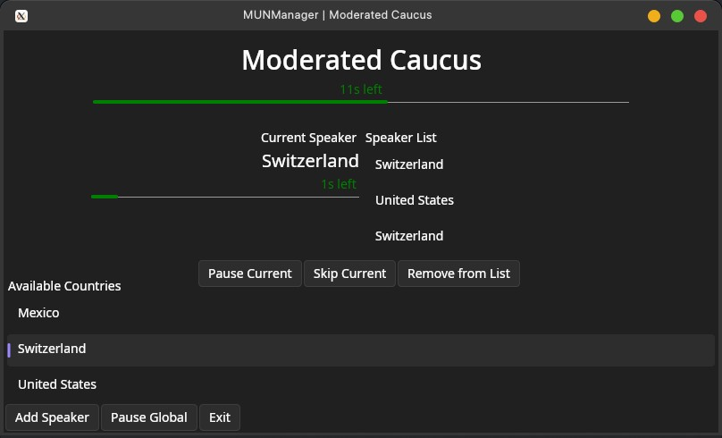

## MUNManager
Built on AvaloniaUI, MUNManager is a cross-platform application for managing Model United Nations conferences. It is currently in development and only recommended for small-scale uses.

### Running the Application
Download the latest release from the releases page and run the executable.
The application requires the latest version of .NET Core.

#### Flags:
- `--debug/-d` Enables debug mode, removing some validation checks.
- `--skipSetup/-s` Skips event setup for quicker testing of the application.

### Features & To do
- [x] Full cross-platform support. Runs on Windows, Linux, and MacOS.
- [x] Manage participating delegations
- [x] Start moderated and unmoderated caucuses. The former has separate timers for the current speaker and the total duration.
- [x] Partial whitelabeling support
    - Since MUNManager is still in early stages of development, we'd appreciate it if you left this field empty, but if you really want to whitelabel most of the application, you can set the "Event Name" field during event creation.
- [ ] (High Priority) Branding
- [ ] Ask whether to yield to the chair or the next speaker
- [ ] Allow importing/exporting event configurations to configuration files
- [ ] Roll calls
- [ ] (Medium Priority) Group observer states during event creation
- [ ] (Low Priority) Flags for delegations
- [ ] (Low Priority) Allow for customizing the timer colors, improve UI
- [ ] (Low Priority) Clean up code. Dirty code doesn't matter a lot due to the application's lightweight nature, but makes collaboration harder than it needs to be.
- [ ] (Not Planned / Help Needed) Web UI with resolution uploading and other features

### Contributing
If you'd like to contribute to MUNManager, please fork the repository and submit a pull request. Your help would be greatly appreciated.

We **strongly** recommend using Linux for development to ensure compatibility (what works on Linux almost always works on other platforms). JetBrains Rider is recommended as well.

Please sign your commits using GPG (preferable) or SSH. If the last commit in your pull request is not signed, we may decide to not merge it until you sign the commit.

This repository is auto-mirrored from RGN Development's Gitea instance.

### License
MUNManager is licensed under AGPL v3.0. See [LICENSE](LICENSE) for more information.

### Screenshots

*The countdown bar is supposed to change colors when the timer is running out. The bug above will be fixed soon.*